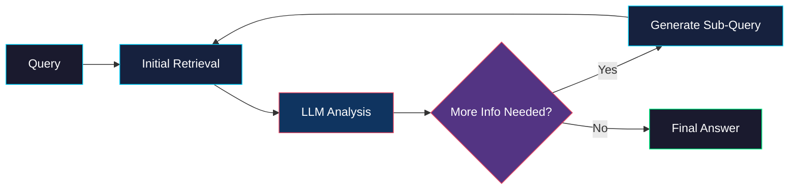
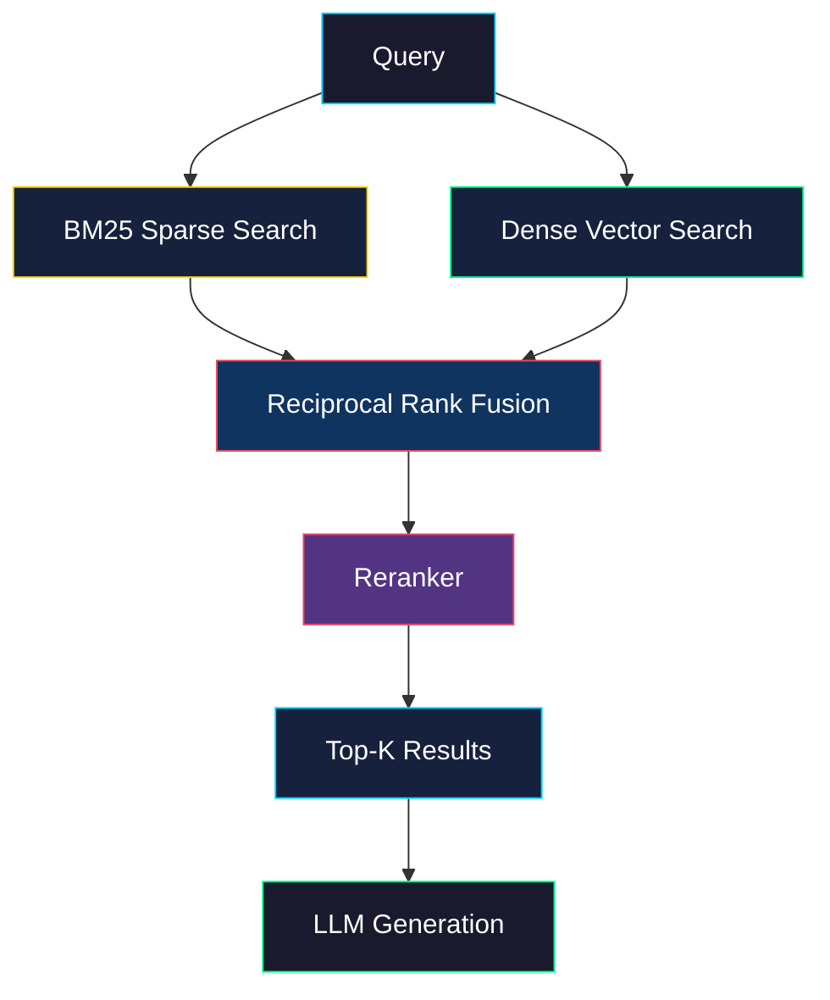
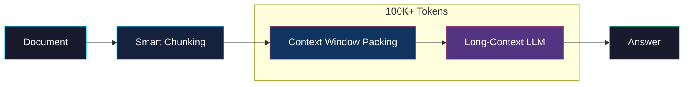
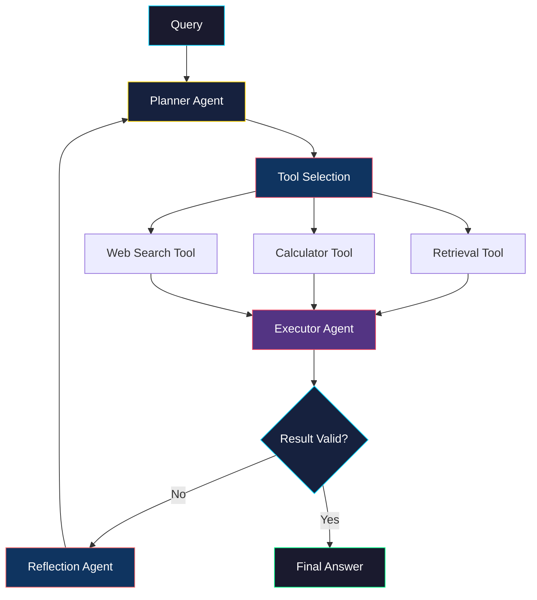
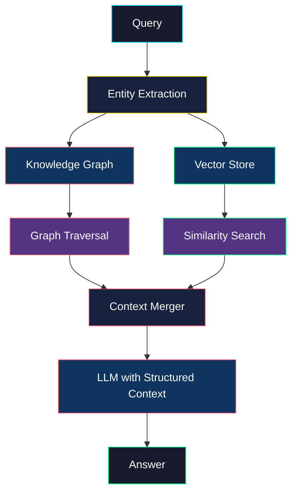
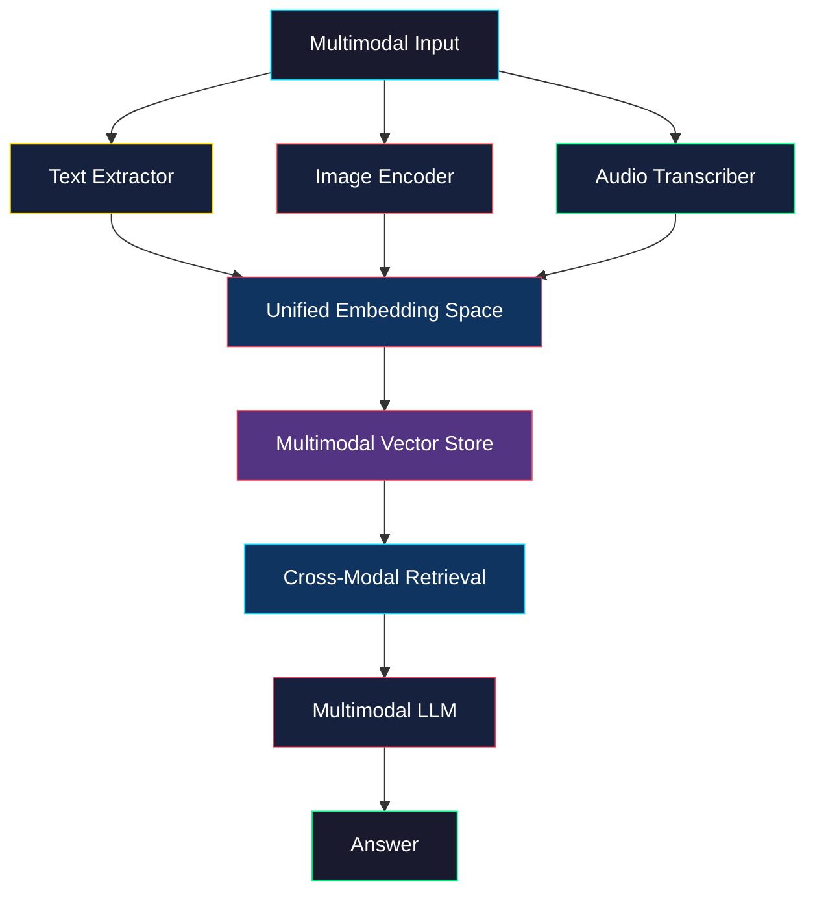

<p align="center">
  
</p>

<h1 align="center">🚀 Awesome RAG Architectures 2025</h1>

<p align="center">
  <strong>The Ultimate Reference for Retrieval-Augmented Generation in 2025</strong>
</p>

<p align="center">
  <a href="https://github.com/harshalDharpure/awesome-rag-architectures-2026/stargazers"></a>
  <a href="https://github.com/harshalDharpure/awesome-rag-architectures-2026/network/members"></a>
  <a href="https://github.com/harshalDharpure/awesome-rag-architectures-2026/blob/main/LICENSE"></a>
  <a href="https://python.org"></a>
</p>

<p align="center">
  <a href="#-why-this-repo">Why This Repo</a> •
  <a href="#-architectures">Architectures</a> •
  <a href="#-quick-start">Quick Start</a> •
  <a href="#-benchmarks">Benchmarks</a> •
  <a href="#-roadmap">Roadmap</a> •
  <a href="#-contributing">Contributing</a>
</p>

---

## ⭐ Star This Repo!

If you find this repository useful, please **star it** to help others discover it!

```
╔══════════════════════════════════════════════════════════════╗
║  🌟 Click the Star button at the top right of this page! 🌟  ║
╚══════════════════════════════════════════════════════════════╝
```

---

## 🎯 Why This Repo?

**2025 marks a paradigm shift in RAG architectures.** The days of simple "chunk → embed → retrieve → generate" are over.

Modern RAG systems now feature:
- 🔗 **Multi-hop reasoning** across multiple documents
- 🔍 **Hybrid search** combining dense and sparse retrieval
- 📚 **Long-context windows** (100K+ tokens)
- 🤖 **Agentic loops** with self-correction
- 🧠 **Knowledge graphs** for structured reasoning
- 🖼️ **Multimodal** understanding (text, images, audio)

This repository provides **production-ready implementations** of all 6 cutting-edge RAG architectures, complete with:

✅ Working Python code  
✅ Interactive Jupyter notebooks  
✅ Detailed Mermaid diagrams  
✅ Performance benchmarks  
✅ Best practices and pitfalls  

---

## 🏗️ Architectures

### Overview Comparison

| Architecture | Best For | Latency | Accuracy | Complexity |
|-------------|----------|---------|----------|------------|
| [Multi-Hop RAG](#1-multi-hop-rag) | Complex reasoning across sources | Medium | ⭐⭐⭐⭐⭐ | Medium |
| [Hybrid Search RAG](#2-hybrid-search-rag) | Keyword + semantic search | Low | ⭐⭐⭐⭐ | Low |
| [Long-Context RAG](#3-long-context-rag) | Large documents, full context | High | ⭐⭐⭐⭐⭐ | Low |
| [Agentic RAG](#4-agentic-rag) | Dynamic, iterative queries | High | ⭐⭐⭐⭐⭐ | High |
| [Knowledge Graph RAG](#5-knowledge-graph-rag) | Entity relationships | Medium | ⭐⭐⭐⭐⭐ | High |
| [Multimodal RAG](#6-multimodal-rag) | Images, PDFs, audio | High | ⭐⭐⭐⭐ | High |

---

### 1. Multi-Hop RAG

> **When to use:** Questions requiring synthesis from multiple documents

Multi-hop RAG iteratively retrieves and reasons across multiple sources to answer complex questions that can't be answered from a single document.



**Key Features:**
- 🔄 Iterative retrieval with sub-query generation
- 🧠 Chain-of-thought reasoning
- 📊 Evidence aggregation
- 🎯 Answer verification

📁 **[View Implementation →](examples/multi-hop/)**

---

### 2. Hybrid Search RAG

> **When to use:** When exact keyword matching AND semantic understanding matter

Combines BM25 sparse retrieval with dense vector search for superior recall.



**Key Features:**
- 📊 BM25 for exact term matching
- 🧬 Dense embeddings for semantic similarity
- 🔀 Reciprocal Rank Fusion (RRF)
- 🎯 Cross-encoder reranking

📁 **[View Implementation →](examples/hybrid-search/)**

---

### 3. Long-Context RAG

> **When to use:** Large documents where full context is critical

Leverages models with 100K+ context windows to process entire documents at once.



**Key Features:**
- 📄 Full document ingestion
- 🎯 No retrieval loss
- 💰 Trade-off: Higher API costs
- ⚡ Models: Claude 3, GPT-4 Turbo, Gemini 1.5

📁 **[View Implementation →](examples/long-context/)**

---

### 4. Agentic RAG

> **When to use:** Dynamic queries requiring tool use and self-correction

The RAG system becomes an autonomous agent that can plan, execute, and reflect.



**Key Features:**
- 🤖 Autonomous planning
- 🛠️ Multi-tool orchestration
- 🔄 Self-correction loops
- 📊 ReAct reasoning pattern

📁 **[View Implementation →](examples/agentic-rag/)**

---

### 5. Knowledge Graph RAG

> **When to use:** Entity-rich domains with complex relationships

Combines vector search with knowledge graph traversal for structured reasoning.



**Key Features:**
- 🕸️ Entity-relationship modeling
- 🔍 Graph traversal algorithms
- 🧠 Structured reasoning
- 📊 Neo4j / NetworkX integration

📁 **[View Implementation →](examples/knowledge-graph/)**

---

### 6. Multimodal RAG

> **When to use:** Documents with images, charts, tables, or audio

Process and reason over multiple modalities simultaneously.



**Key Features:**
- 🖼️ Vision-language models (GPT-4V, LLaVA)
- 🎵 Audio transcription (Whisper)
- 📊 Table/chart understanding
- 🔀 Cross-modal retrieval

📁 **[View Implementation →](examples/multimodal/)**

---

## 🚀 Quick Start

### Prerequisites

```bash
# Clone the repository
git clone https://github.com/harshalDharpure/awesome-rag-architectures-2026.git
cd awesome-rag-architectures-2025

# Create virtual environment
python -m venv venv
source venv/bin/activate  # On Windows: venv\Scripts\activate

# Install dependencies
pip install -r requirements.txt
```

### Environment Setup

```bash
# Create .env file
cp .env.example .env

# Add your API keys
OPENAI_API_KEY=your-openai-key
HUGGINGFACE_TOKEN=your-hf-token
```

### Run an Example

```bash
# Run Multi-Hop RAG
python examples/multi-hop/multi-hop.py

# Or use Jupyter
jupyter notebook examples/multi-hop/multi-hop.ipynb
```

---

## 📊 Benchmarks

### Embedding Quality

| Model | MTEB Score | Dimensions | Speed |
|-------|------------|------------|-------|
| `text-embedding-3-large` | 64.6 | 3072 | Fast |
| `bge-large-en-v1.5` | 64.2 | 1024 | Medium |
| `e5-large-v2` | 62.0 | 1024 | Medium |
| `all-MiniLM-L6-v2` | 56.3 | 384 | Very Fast |

### Retrieval Latency (1M documents)

| Vector Store | P50 Latency | P99 Latency | Memory |
|--------------|-------------|-------------|--------|
| FAISS (IVF) | 2ms | 8ms | 4GB |
| ChromaDB | 5ms | 15ms | 6GB |
| Qdrant | 3ms | 10ms | 5GB |
| Pinecone | 8ms | 25ms | Cloud |

### RAG Evaluation (HotpotQA)

| Architecture | Faithfulness | Answer Relevancy | Latency |
|--------------|--------------|------------------|---------|
| Multi-Hop | 0.92 | 0.89 | 2.1s |
| Hybrid Search | 0.88 | 0.91 | 0.8s |
| Long-Context | 0.95 | 0.93 | 3.5s |
| Agentic | 0.94 | 0.92 | 4.2s |
| Knowledge Graph | 0.91 | 0.88 | 1.5s |
| Multimodal | 0.87 | 0.85 | 2.8s |

📁 **[View Full Benchmarks →](benchmarks/)**

---

## 🗺️ Roadmap

### Q1 2025
- [x] Core 6 architectures
- [x] Utility modules
- [x] Benchmark suite
- [ ] Docker containers
- [ ] Streamlit demos

### Q2 2025
- [ ] Self-RAG implementation
- [ ] Corrective RAG (CRAG)
- [ ] Speculative RAG
- [ ] RAG Fusion
- [ ] Production deployment guides

### Q3 2025
- [ ] Enterprise patterns
- [ ] Cost optimization guide
- [ ] Multi-tenant RAG
- [ ] RAG observability (LangSmith, Phoenix)

### Q4 2025
- [ ] Video RAG
- [ ] Real-time RAG
- [ ] Edge RAG (mobile/browser)
- [ ] RAG security patterns

---

## 📁 Repository Structure

```
awesome-rag-architectures-2025/
│
├── README.md                    # You are here
├── LICENSE                      # MIT License
├── CONTRIBUTING.md              # Contribution guidelines
├── MARKETING.md                 # Viral marketing strategy
├── requirements.txt             # Python dependencies
│
├── /banner/                     # Repository banner
│   └── banner.png
│
├── /diagrams/                   # Architecture diagrams (Mermaid)
│   ├── multi-hop-rag.md
│   ├── hybrid-search-rag.md
│   ├── long-context-rag.md
│   ├── agentic-rag.md
│   ├── knowledge-graph-rag.md
│   └── multimodal-rag.md
│
├── /examples/                   # Working implementations
│   ├── multi-hop/
│   ├── hybrid-search/
│   ├── long-context/
│   ├── agentic-rag/
│   ├── knowledge-graph/
│   └── multimodal/
│
├── /utils/                      # Shared utilities
│   ├── loaders.py
│   ├── chunking.py
│   ├── embeddings.py
│   ├── llm.py
│   └── search.py
│
└── /benchmarks/                 # Evaluation scripts
    ├── embedding-quality/
    ├── retrieval-latency/
    └── rag-eval/
```

---

## 🤝 Contributing

We welcome contributions! Please see [CONTRIBUTING.md](CONTRIBUTING.md) for guidelines.

Ways to contribute:
- 🐛 Report bugs
- 💡 Suggest features
- 📝 Improve documentation
- 🔧 Submit pull requests

---

## 📜 License

This project is licensed under the MIT License - see the [LICENSE](LICENSE) file for details.

---

## 🙏 Credits

Built with ❤️ by the open-source community.

Special thanks to:
- [LangChain](https://github.com/langchain-ai/langchain)
- [LlamaIndex](https://github.com/run-llama/llama_index)
- [Hugging Face](https://huggingface.co)
- [OpenAI](https://openai.com)
- [ChromaDB](https://www.trychroma.com)

---

## 🌟 Star History

[](https://star-history.com/#harshalDharpure/awesome-rag-architectures-2026&Date)

---

<p align="center">
  <strong>If this repo helped you, please ⭐ star it!</strong>
</p>

<p align="center">
  <a href="https://twitter.com/intent/tweet?text=Check%20out%20Awesome%20RAG%20Architectures%202025%20-%20The%20ultimate%20guide%20to%20modern%20RAG%20systems!&url=https://github.com/harshalDharpure/awesome-rag-architectures-2026">
    
  </a>
  <a href="https://www.linkedin.com/sharing/share-offsite/?url=https://github.com/harshalDharpure/awesome-rag-architectures-2026">
    
  </a>
</p>

