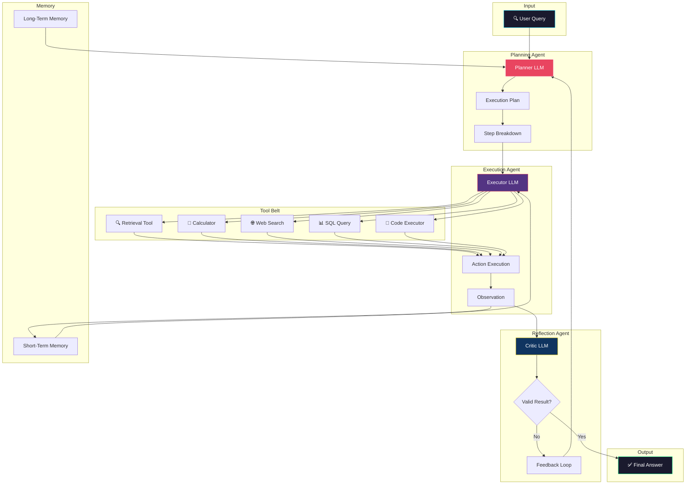
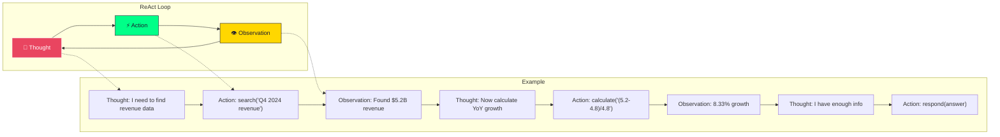
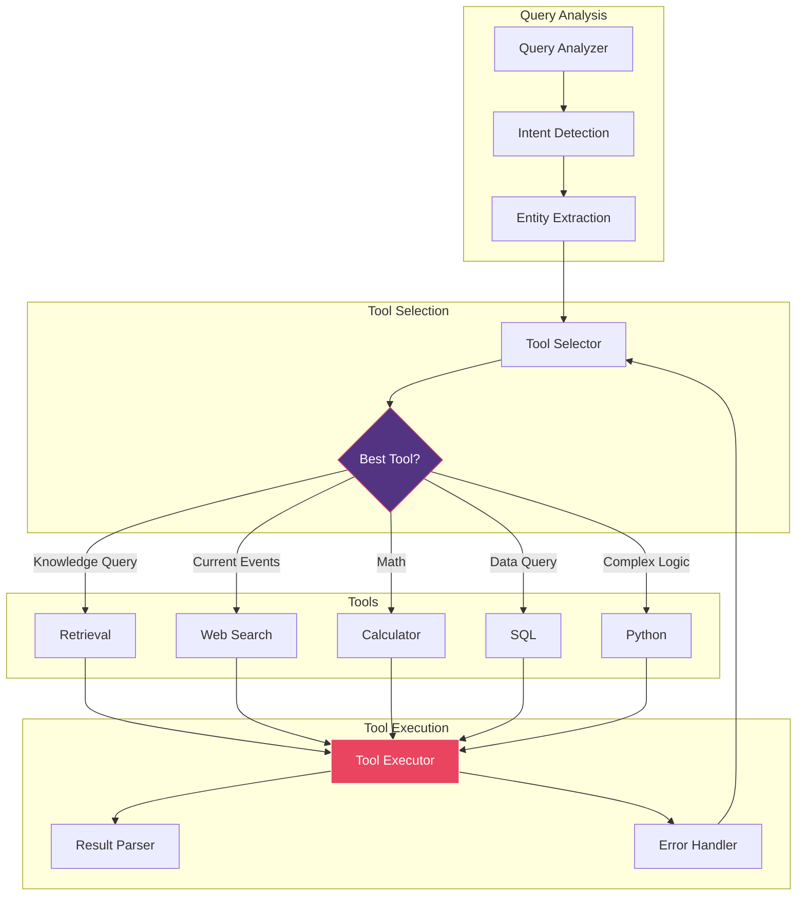
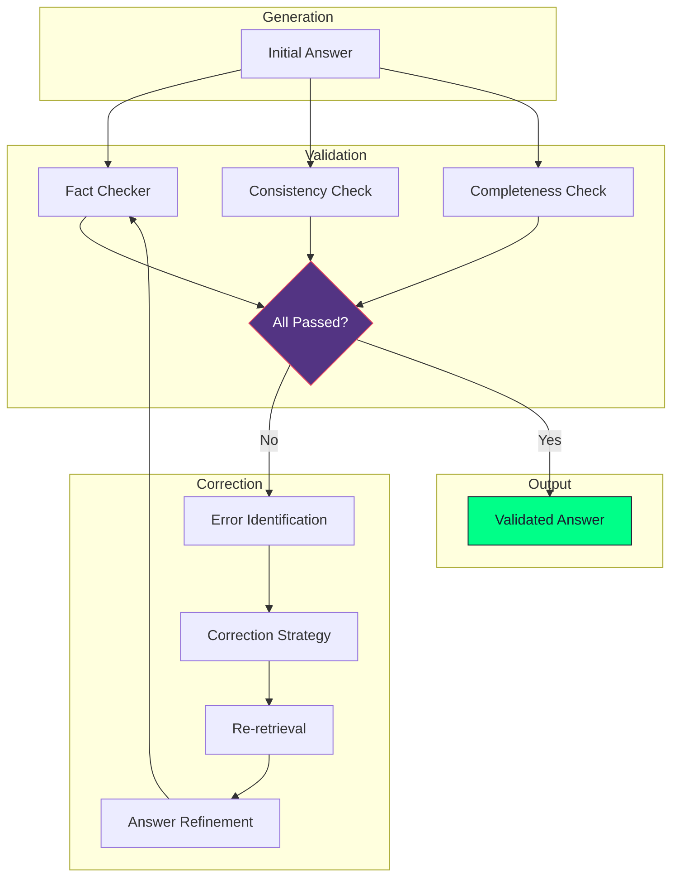

# Agentic RAG Architecture Diagram

## Overview

Agentic RAG transforms the retrieval system into an autonomous agent capable of planning, tool use, and self-correction.

## Architecture Diagram

## ReAct Pattern

## Tool Orchestration

## Self-Correction Loop

## Agent Types Comparison

| Agent Type | Planning | Tools | Memory | Self-Correction |
|------------|----------|-------|--------|-----------------|
| Simple RAG | ❌ | ❌ | ❌ | ❌ |
| ReAct Agent | ✅ | ✅ | Short-term | ❌ |
| Plan-Execute | ✅✅ | ✅ | Short-term | ❌ |
| Reflexion | ✅ | ✅ | Long-term | ✅ |
| **Full Agentic** | ✅✅ | ✅✅ | Both | ✅✅ |

## When to Use

✅ **Use Agentic RAG when:**
- Complex multi-step reasoning needed
- Multiple tools/data sources required
- Query requires real-time data
- Self-correction is valuable
- Tasks require planning and decomposition

❌ **Avoid when:**
- Simple factual queries
- Latency is critical (<2s)
- Deterministic answers required
- Cost is primary concern
- Debugging complexity is an issue

