# Hybrid Search RAG Architecture Diagram

## Overview

Hybrid Search RAG combines sparse (BM25) and dense (vector) retrieval methods for superior recall and precision.

## Architecture Diagram

```mermaid
flowchart TB
    subgraph Input
        Q[🔍 User Query]
    end

    subgraph "Dual Retrieval Path"
        direction TB
        subgraph "Sparse Path"
            TOK[Tokenizer]
            BM25[(BM25 Index)]
            SR[Sparse Results]
        end
        
        subgraph "Dense Path"
            EMB[Embedding Model]
            VS[(Vector Store)]
            DR[Dense Results]
        end
    end

    subgraph "Fusion Layer"
        RRF[Reciprocal Rank Fusion]
        FUSED[Fused Results]
    end

    subgraph "Reranking"
        RERANK[Cross-Encoder Reranker]
        TOPK[Top-K Results]
    end

    subgraph "Generation"
        CTX[Context Builder]
        LLM[🤖 LLM]
        ANS[✅ Answer]
    end

    Q --> TOK
    Q --> EMB
    TOK --> BM25
    EMB --> VS
    BM25 --> SR
    VS --> DR
    SR --> RRF
    DR --> RRF
    RRF --> FUSED
    FUSED --> RERANK
    RERANK --> TOPK
    TOPK --> CTX
    CTX --> LLM
    LLM --> ANS

    style Q fill:#1a1a2e,stroke:#00d4ff,color:#fff
    style TOK fill:#16213e,stroke:#ffd700,color:#fff
    style EMB fill:#16213e,stroke:#00ff88,color:#fff
    style BM25 fill:#0f3460,stroke:#ffd700,color:#fff
    style VS fill:#0f3460,stroke:#00ff88,color:#fff
    style RRF fill:#533483,stroke:#e94560,color:#fff
    style RERANK fill:#e94560,stroke:#fff,color:#fff
    style LLM fill:#e94560,stroke:#fff,color:#fff
    style ANS fill:#1a1a2e,stroke:#00ff88,color:#fff
```

## Detailed Fusion Diagram

```mermaid
flowchart LR
    subgraph "BM25 Ranking"
        B1[Doc A: Rank 1]
        B2[Doc C: Rank 2]
        B3[Doc E: Rank 3]
        B4[Doc B: Rank 4]
    end

    subgraph "Vector Ranking"
        V1[Doc B: Rank 1]
        V2[Doc A: Rank 2]
        V3[Doc D: Rank 3]
        V4[Doc C: Rank 4]
    end

    subgraph "RRF Calculation"
        RRF["RRF(d) = Σ 1/(k + rank(d))"]
    end

    subgraph "Final Ranking"
        F1[Doc A: Score 0.083]
        F2[Doc B: Score 0.066]
        F3[Doc C: Score 0.058]
        F4[Doc D: Score 0.016]
        F5[Doc E: Score 0.016]
    end

    B1 --> RRF
    B2 --> RRF
    B3 --> RRF
    B4 --> RRF
    V1 --> RRF
    V2 --> RRF
    V3 --> RRF
    V4 --> RRF
    RRF --> F1
    RRF --> F2
    RRF --> F3
    RRF --> F4
    RRF --> F5

    style RRF fill:#e94560,stroke:#fff,color:#fff
    style F1 fill:#00ff88,stroke:#1a1a2e,color:#1a1a2e
```

## Component Details

## Weight Tuning Strategies

```mermaid
flowchart LR
    subgraph "Static Weights"
        SW[α=0.5, β=0.5]
    end

    subgraph "Query-Adaptive"
        QA1[Query Type Detection]
        QA2{Keyword Heavy?}
        QA3[α=0.7, β=0.3]
        QA4[α=0.3, β=0.7]
        
        QA1 --> QA2
        QA2 -->|Yes| QA3
        QA2 -->|No| QA4
    end

    subgraph "Learned Weights"
        LW1[Training Data]
        LW2[Gradient Descent]
        LW3[Optimal α, β]
        
        LW1 --> LW2 --> LW3
    end

    style SW fill:#16213e,stroke:#00d4ff,color:#fff
    style QA2 fill:#533483,stroke:#e94560,color:#fff
    style LW3 fill:#00ff88,stroke:#1a1a2e,color:#1a1a2e
```

## Performance Comparison

| Method | Recall@10 | Precision@10 | MRR |
|--------|-----------|--------------|-----|
| BM25 Only | 0.72 | 0.65 | 0.58 |
| Dense Only | 0.78 | 0.71 | 0.64 |
| **Hybrid (RRF)** | **0.89** | **0.82** | **0.76** |
| Hybrid + Rerank | 0.91 | 0.87 | 0.81 |

## When to Use

✅ **Use Hybrid Search when:**
- Queries mix keywords and concepts
- Domain has specific terminology
- High recall is critical
- Dealing with technical documentation

❌ **Avoid when:**
- Purely semantic queries
- Extreme latency requirements
- Simple factual lookups
- Index size is a constraint

