# Knowledge Graph RAG Architecture Diagram

## Overview

Knowledge Graph RAG combines structured knowledge graphs with vector search for entity-aware, relationship-rich retrieval.

## Architecture Diagram

```mermaid
flowchart TB
    subgraph Input
        Q[🔍 User Query]
    end

    subgraph "Entity Processing"
        NER[Named Entity Recognition]
        EL[Entity Linking]
        ED[Entity Disambiguation]
    end

    subgraph "Dual Retrieval"
        direction TB
        subgraph "Graph Path"
            KG[(Knowledge Graph)]
            GT[Graph Traversal]
            GP[Graph Patterns]
        end
        
        subgraph "Vector Path"
            VS[(Vector Store)]
            SIM[Similarity Search]
            TOP[Top-K Chunks]
        end
    end

    subgraph "Context Fusion"
        MERGE[Context Merger]
        RANK[Relevance Ranker]
        CTX[Unified Context]
    end

    subgraph "Generation"
        LLM[🤖 LLM]
        ANS[✅ Answer]
    end

    Q --> NER
    NER --> EL
    EL --> ED
    ED --> KG
    ED --> VS
    KG --> GT
    GT --> GP
    VS --> SIM
    SIM --> TOP
    GP --> MERGE
    TOP --> MERGE
    MERGE --> RANK
    RANK --> CTX
    CTX --> LLM
    LLM --> ANS

    style Q fill:#1a1a2e,stroke:#00d4ff,color:#fff
    style KG fill:#0f3460,stroke:#ff6b6b,color:#fff
    style VS fill:#0f3460,stroke:#00ff88,color:#fff
    style MERGE fill:#533483,stroke:#e94560,color:#fff
    style LLM fill:#e94560,stroke:#fff,color:#fff
    style ANS fill:#1a1a2e,stroke:#00ff88,color:#fff
```

## Knowledge Graph Structure

## Graph Traversal Patterns

## Entity Extraction Pipeline

## Hybrid Context Assembly

## Graph Database Options

| Database | Type | Scalability | Query Language | Best For |
|----------|------|-------------|----------------|----------|
| Neo4j | Native Graph | High | Cypher | Enterprise |
| NetworkX | In-Memory | Medium | Python | Prototyping |
| Amazon Neptune | Cloud | Very High | Gremlin/SPARQL | AWS Stack |
| TigerGraph | Native Graph | Very High | GSQL | Analytics |

## When to Use

✅ **Use Knowledge Graph RAG when:**
- Domain has rich entity relationships
- Questions involve multi-hop reasoning
- Structured knowledge is critical
- Consistency and accuracy matter
- Enterprise knowledge management

❌ **Avoid when:**
- Simple keyword queries
- Unstructured domains
- Rapid prototyping needed
- Graph construction is costly
- Real-time updates required

