# Long-Context RAG Architecture Diagram

## Overview

Long-Context RAG leverages models with 100K+ token context windows to process entire documents without chunking-induced information loss.

## Architecture Diagram

```mermaid
flowchart TB
    subgraph Input
        D[📄 Large Document]
        Q[🔍 Query]
    end

    subgraph "Document Processing"
        PARSE[Document Parser]
        STRUCT[Structure Analyzer]
        SEC[Section Extractor]
    end

    subgraph "Context Window Management"
        PACK[Context Packer]
        PRIO[Priority Ranker]
        WIN[100K Token Window]
    end

    subgraph "Long-Context LLM"
        ATTN[Extended Attention]
        POS[Positional Encoding]
        LLM[🤖 Claude 3 / GPT-4 / Gemini]
    end

    subgraph Output
        ANS[✅ Answer]
        CIT[📍 Citations]
    end

    D --> PARSE
    PARSE --> STRUCT
    STRUCT --> SEC
    SEC --> PACK
    Q --> PRIO
    PRIO --> PACK
    PACK --> WIN
    WIN --> ATTN
    ATTN --> POS
    POS --> LLM
    LLM --> ANS
    LLM --> CIT

    style D fill:#1a1a2e,stroke:#00d4ff,color:#fff
    style Q fill:#1a1a2e,stroke:#ffd700,color:#fff
    style WIN fill:#533483,stroke:#e94560,color:#fff
    style LLM fill:#e94560,stroke:#fff,color:#fff
    style ANS fill:#1a1a2e,stroke:#00ff88,color:#fff
```

## Context Window Comparison

## Context Packing Strategy

## Model Comparison

```mermaid
flowchart LR
    subgraph "Context Windows 2025"
        C1[GPT-4 Turbo: 128K]
        C2[Claude 3: 200K]
        C3[Gemini 1.5 Pro: 1M]
        C4[Llama 3 Long: 128K]
    end

    subgraph "Effective Context"
        E1[128K → ~100 pages]
        E2[200K → ~150 pages]
        E3[1M → ~750 pages]
        E4[128K → ~100 pages]
    end

    C1 --> E1
    C2 --> E2
    C3 --> E3
    C4 --> E4

    style C3 fill:#00ff88,stroke:#1a1a2e,color:#1a1a2e
    style E3 fill:#00ff88,stroke:#1a1a2e,color:#1a1a2e
```

## Attention Pattern

```mermaid
flowchart TB
    subgraph "Standard Attention"
        SA["O(n²) Complexity"]
        SAM[Memory: High]
    end

    subgraph "Optimized Attention"
        FA["Flash Attention 2"]
        SW["Sliding Window"]
        SP["Sparse Attention"]
    end

    subgraph "Benefits"
        B1[Lower Memory]
        B2[Faster Inference]
        B3[Longer Context]
    end

    SA --> FA
    FA --> B1
    FA --> B2
    SW --> B2
    SW --> B3
    SP --> B1
    SP --> B3

    style FA fill:#e94560,stroke:#fff,color:#fff
```

## Cost Analysis

| Model | Context | Cost/1M Input | Cost/1M Output | 100K Doc Cost |
|-------|---------|---------------|----------------|---------------|
| GPT-4 Turbo | 128K | $10.00 | $30.00 | ~$1.00 |
| Claude 3 Opus | 200K | $15.00 | $75.00 | ~$1.50 |
| Gemini 1.5 Pro | 1M | $7.00 | $21.00 | ~$0.70 |
| Claude 3 Sonnet | 200K | $3.00 | $15.00 | ~$0.30 |

## When to Use

✅ **Use Long-Context RAG when:**
- Full document context is critical
- Information is distributed throughout document
- Chunking causes context loss
- Legal/financial document analysis
- Code repository understanding

❌ **Avoid when:**
- Cost is a primary concern
- Latency < 5s required
- Simple keyword queries
- Documents > context window
- High query volume

