# Multi-Hop RAG Architecture Diagram

## Overview

Multi-Hop RAG enables complex reasoning across multiple documents by iteratively retrieving and synthesizing information.

## Architecture Diagram

```mermaid
flowchart TB
    subgraph Input
        Q[🔍 User Query]
    end

    subgraph "Initial Retrieval Phase"
        QE[Query Encoder]
        VS[(Vector Store)]
        D1[📄 Doc Chunk 1]
        D2[📄 Doc Chunk 2]
        D3[📄 Doc Chunk 3]
    end

    subgraph "Reasoning Phase"
        LLM1[🤖 LLM Analysis]
        DEC{Decision Gate}
        SQ[Sub-Query Generator]
    end

    subgraph "Iterative Loop"
        QE2[Query Encoder]
        VS2[(Vector Store)]
        D4[📄 Additional Chunks]
    end

    subgraph "Synthesis Phase"
        AGG[Evidence Aggregator]
        LLM2[🤖 Final Synthesis]
        VER[Answer Verifier]
    end

    subgraph Output
        A[✅ Final Answer]
    end

    Q --> QE
    QE --> VS
    VS --> D1
    VS --> D2
    VS --> D3
    D1 --> LLM1
    D2 --> LLM1
    D3 --> LLM1
    LLM1 --> DEC
    DEC -->|"Need More Info"| SQ
    SQ --> QE2
    QE2 --> VS2
    VS2 --> D4
    D4 --> LLM1
    DEC -->|"Sufficient Info"| AGG
    AGG --> LLM2
    LLM2 --> VER
    VER --> A

    style Q fill:#1a1a2e,stroke:#00d4ff,color:#fff
    style QE fill:#16213e,stroke:#00d4ff,color:#fff
    style VS fill:#0f3460,stroke:#e94560,color:#fff
    style D1 fill:#533483,stroke:#ffd700,color:#fff
    style D2 fill:#533483,stroke:#ffd700,color:#fff
    style D3 fill:#533483,stroke:#ffd700,color:#fff
    style LLM1 fill:#e94560,stroke:#fff,color:#fff
    style DEC fill:#16213e,stroke:#00ff88,color:#fff
    style SQ fill:#0f3460,stroke:#00d4ff,color:#fff
    style AGG fill:#533483,stroke:#e94560,color:#fff
    style LLM2 fill:#e94560,stroke:#fff,color:#fff
    style VER fill:#16213e,stroke:#00ff88,color:#fff
    style A fill:#1a1a2e,stroke:#00ff88,color:#fff
```

## Detailed Component Diagram

## Sequence Diagram

## Key Metrics

| Metric | Target | Description |
|--------|--------|-------------|
| Max Hops | 3-5 | Maximum retrieval iterations |
| Hop Latency | <500ms | Time per retrieval hop |
| Evidence Threshold | 0.8 | Minimum confidence to stop |
| Context Window | 8K-32K | Tokens per LLM call |

## When to Use

✅ **Use Multi-Hop RAG when:**
- Questions require reasoning across multiple documents
- Information is distributed across sources
- Follow-up context is needed to answer completely
- Complex analytical questions

❌ **Avoid when:**
- Simple factual lookups
- Single document answers
- Latency is critical (<1s)
- Cost optimization is priority

