# Multimodal RAG Architecture Diagram

## Overview

Multimodal RAG processes and reasons across multiple data types: text, images, audio, and video.

## Architecture Diagram

```mermaid
flowchart TB
    subgraph "Multimodal Input"
        I1[📄 Text Documents]
        I2[🖼️ Images]
        I3[🎵 Audio Files]
        I4[📊 Tables/Charts]
    end

    subgraph "Modality-Specific Processing"
        P1[Text Extractor]
        P2[Vision Encoder]
        P3[Audio Transcriber]
        P4[Table Parser]
    end

    subgraph "Unified Embedding Space"
        E1[Text Embeddings]
        E2[Image Embeddings]
        E3[Audio Embeddings]
        E4[Table Embeddings]
        ALIGN[Alignment Layer]
    end

    subgraph "Multimodal Vector Store"
        VS[(Unified Index)]
    end

    subgraph "Cross-Modal Retrieval"
        Q[🔍 Query]
        RET[Retriever]
        RES[Mixed Results]
    end

    subgraph "Multimodal LLM"
        CTX[Context Assembly]
        MLLM[🤖 GPT-4V / LLaVA]
        ANS[✅ Answer]
    end

    I1 --> P1
    I2 --> P2
    I3 --> P3
    I4 --> P4
    P1 --> E1
    P2 --> E2
    P3 --> E3
    P4 --> E4
    E1 --> ALIGN
    E2 --> ALIGN
    E3 --> ALIGN
    E4 --> ALIGN
    ALIGN --> VS
    Q --> RET
    VS --> RET
    RET --> RES
    RES --> CTX
    CTX --> MLLM
    MLLM --> ANS

    style Q fill:#1a1a2e,stroke:#00d4ff,color:#fff
    style VS fill:#533483,stroke:#e94560,color:#fff
    style MLLM fill:#e94560,stroke:#fff,color:#fff
    style ANS fill:#1a1a2e,stroke:#00ff88,color:#fff
```

## Image Processing Pipeline

```mermaid
flowchart LR
    subgraph "Image Input"
        IMG[🖼️ Image]
    end

    subgraph "Processing Options"
        direction TB
        O1[OCR Text Extraction]
        O2[Vision Encoder]
        O3[Object Detection]
        O4[Caption Generation]
    end

    subgraph "Embeddings"
        E1[Text Embedding]
        E2[Image Embedding]
        E3[Object Embedding]
        E4[Caption Embedding]
    end

    subgraph "Storage"
        VS[(Vector Store)]
        META[Metadata]
    end

    IMG --> O1 --> E1 --> VS
    IMG --> O2 --> E2 --> VS
    IMG --> O3 --> E3 --> VS
    IMG --> O4 --> E4 --> VS
    E1 --> META
    E2 --> META
    E3 --> META
    E4 --> META

    style IMG fill:#ffd700,stroke:#1a1a2e,color:#1a1a2e
    style VS fill:#00ff88,stroke:#1a1a2e,color:#1a1a2e
```

## Audio Processing Pipeline

```mermaid
flowchart LR
    subgraph "Audio Input"
        AUD[🎵 Audio File]
    end

    subgraph "Transcription"
        WHI[Whisper ASR]
        TXT[Transcribed Text]
    end

    subgraph "Enhancement"
        SPK[Speaker Diarization]
        TS[Timestamps]
        SENT[Sentiment Analysis]
    end

    subgraph "Chunking"
        CH1[Sentence-Level]
        CH2[Speaker-Turn]
        CH3[Time-Window]
    end

    subgraph "Embedding & Storage"
        EMB[Text Embedding]
        VS[(Vector Store)]
    end

    AUD --> WHI --> TXT
    TXT --> SPK
    TXT --> TS
    TXT --> SENT
    SPK --> CH2
    TS --> CH3
    TXT --> CH1
    CH1 --> EMB
    CH2 --> EMB
    CH3 --> EMB
    EMB --> VS

    style AUD fill:#e94560,stroke:#fff,color:#fff
    style VS fill:#00ff88,stroke:#1a1a2e,color:#1a1a2e
```

## Cross-Modal Retrieval

```mermaid
flowchart TB
    subgraph "Query Types"
        Q1["Text: 'Show me charts about revenue'"]
        Q2["Image: [Screenshot of chart]"]
        Q3["Audio: 'Find mentions of AI'"]
    end

    subgraph "Query Processing"
        QE[Query Encoder]
        QV[Query Vector]
    end

    subgraph "Unified Index"
        VS[(Multimodal Index)]
        T1[Text Chunks]
        I1[Image Embeddings]
        A1[Audio Transcripts]
    end

    subgraph "Results"
        R1[📄 Relevant Text]
        R2[🖼️ Matching Images]
        R3[🎵 Audio Segments]
    end

    Q1 --> QE
    Q2 --> QE
    Q3 --> QE
    QE --> QV
    QV --> VS
    VS --> T1
    VS --> I1
    VS --> A1
    T1 --> R1
    I1 --> R2
    A1 --> R3

    style QV fill:#533483,stroke:#e94560,color:#fff
    style VS fill:#0f3460,stroke:#00d4ff,color:#fff
```

## Vision-Language Models

```mermaid
flowchart LR
    subgraph "Image Understanding"
        IMG[🖼️ Image]
        VIT[Vision Transformer]
        FEAT[Visual Features]
    end

    subgraph "Text Understanding"
        TXT[📄 Text Query]
        TOK[Tokenizer]
        TEMB[Text Embeddings]
    end

    subgraph "Fusion"
        CROSS[Cross-Attention]
        FUSE[Fused Representation]
    end

    subgraph "Generation"
        DEC[Decoder]
        OUT[Response]
    end

    IMG --> VIT --> FEAT
    TXT --> TOK --> TEMB
    FEAT --> CROSS
    TEMB --> CROSS
    CROSS --> FUSE
    FUSE --> DEC --> OUT

    style CROSS fill:#e94560,stroke:#fff,color:#fff
    style OUT fill:#00ff88,stroke:#1a1a2e,color:#1a1a2e
```

## Model Comparison

| Model | Text | Images | Audio | Video | Context |
|-------|------|--------|-------|-------|---------|
| GPT-4V | ✅ | ✅ | ❌ | ❌ | 128K |
| Claude 3 | ✅ | ✅ | ❌ | ❌ | 200K |
| Gemini 1.5 | ✅ | ✅ | ✅ | ✅ | 1M |
| LLaVA 1.6 | ✅ | ✅ | ❌ | ❌ | 32K |

## When to Use

✅ **Use Multimodal RAG when:**
- Documents contain images/charts
- Audio/video content is important
- Visual understanding is required
- Cross-modal queries are common
- Rich document formats (PDFs with images)

❌ **Avoid when:**
- Text-only documents
- Simple factual queries
- Latency is critical
- Cost optimization is priority
- Privacy concerns with vision APIs

