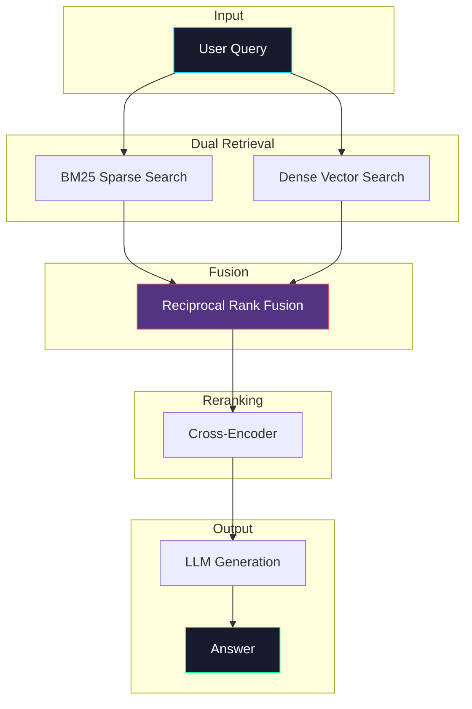

# Hybrid Search RAG

> **Combining dense vector search with sparse BM25 for superior retrieval**

## 📖 Overview

Hybrid Search RAG combines the semantic understanding of dense embeddings with the precision of keyword-based BM25 search. This approach achieves better recall and relevance than either method alone.

### When to Use

✅ **Best for:**
- Technical documentation with specific terminology
- Legal/medical domains with exact phrase matching needs
- Queries mixing concepts and keywords
- High-stakes retrieval where recall matters

❌ **Avoid for:**
- Purely semantic similarity tasks
- Extreme low-latency requirements
- Simple chatbots with casual queries

## 🏗️ Architecture



## 🔧 How It Works

### Step 1: Dual Retrieval
Run two parallel searches:
- **BM25**: Token-based matching using TF-IDF scoring
- **Dense**: Semantic similarity using embeddings

### Step 2: Score Fusion
Combine results using Reciprocal Rank Fusion (RRF):
```
RRF(d) = Σ 1/(k + rank(d))
```
Where k is typically 60.

### Step 3: Reranking (Optional)
Use a cross-encoder to re-score top candidates for maximum precision.

### Step 4: Generation
Pass top results to LLM for answer generation.

## 💻 Quick Start

```python
from hybrid_search import HybridSearchRAG

# Initialize
rag = HybridSearchRAG(
    embedding_model="all-MiniLM-L6-v2",
    vector_weight=0.5,
    bm25_weight=0.5,
    use_reranker=True
)

# Index documents
rag.index_documents(documents)

# Query
answer = rag.query("What is the API rate limit for the /users endpoint?")
print(answer)
```

## 📊 Performance Comparison

| Method | Recall@10 | Precision@10 | MRR |
|--------|-----------|--------------|-----|
| BM25 Only | 0.72 | 0.65 | 0.58 |
| Dense Only | 0.78 | 0.71 | 0.64 |
| **Hybrid (RRF)** | **0.89** | **0.82** | **0.76** |
| Hybrid + Rerank | 0.91 | 0.87 | 0.81 |

## ⚙️ Tuning Weights

The optimal weight balance depends on your domain:

| Domain | Vector Weight | BM25 Weight |
|--------|---------------|-------------|
| General QA | 0.6 | 0.4 |
| Technical Docs | 0.4 | 0.6 |
| Legal | 0.3 | 0.7 |
| Creative Writing | 0.8 | 0.2 |

## ⚠️ Limitations

1. **Index Size**: Requires maintaining two indices
2. **Latency**: Parallel searches add overhead
3. **Tuning**: Weights need domain-specific optimization
4. **Memory**: BM25 index can be large for big corpora

## 🎯 Best Practices

1. **Normalize scores**: Ensure both search methods use comparable scales
2. **Tune k for RRF**: Start with k=60, adjust based on results
3. **Use reranking**: Always rerank for production systems
4. **A/B test weights**: Find optimal balance for your domain

## 📚 References

- [Reciprocal Rank Fusion](https://plg.uwaterloo.ca/~gvcormac/cormacksigir09-rrf.pdf)
- [BM25: A Comparative Study](https://www.cs.otago.ac.nz/homepages/andrew/papers/2014-2.pdf)
- [Dense Passage Retrieval](https://arxiv.org/abs/2004.04906)

