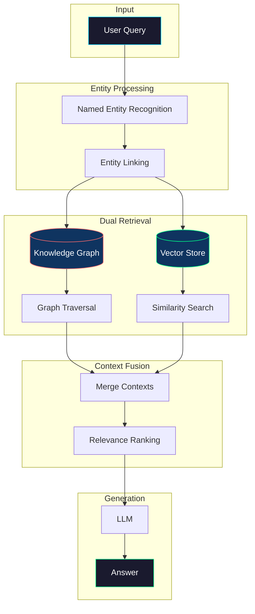

# Knowledge Graph RAG

> **Combining structured knowledge graphs with vector search for entity-aware retrieval**

## 📖 Overview

Knowledge Graph RAG enhances traditional retrieval by incorporating structured entity relationships. It excels at answering questions about entity attributes, relationships, and multi-hop reasoning over connected data.

### When to Use

✅ **Best for:**
- Entity-rich domains (people, companies, products)
- Questions about relationships
- Multi-hop reasoning (A → B → C)
- When structured knowledge matters

❌ **Avoid for:**
- Domains without clear entities
- Simple keyword searches
- When graph construction is too costly
- Real-time knowledge updates

## 🏗️ Architecture



## 🔧 How It Works

### Step 1: Entity Extraction
Extract named entities from the query using NER:
- People, organizations, locations
- Products, technologies
- Dates, quantities

### Step 2: Entity Linking
Link extracted entities to knowledge graph nodes:
- Fuzzy matching for variations
- Disambiguation using context
- Create new nodes if needed

### Step 3: Graph Traversal
Explore relationships from matched entities:
- 1-hop: Direct relationships
- 2-hop: Relationships of relationships
- Path finding: Connect two entities

### Step 4: Context Fusion
Combine graph knowledge with vector search results:
- Structured facts from graph
- Unstructured context from documents
- Weighted combination

## 💻 Quick Start

```python
from kg_rag import KnowledgeGraphRAG

# Initialize
rag = KnowledgeGraphRAG(
    embedding_model="all-MiniLM-L6-v2",
    llm_model="gpt-4o",
    graph_backend="networkx"  # or "neo4j"
)

# Add entities and relationships
rag.add_entity("Apple", {"type": "Company", "industry": "Technology"})
rag.add_entity("Tim Cook", {"type": "Person", "role": "CEO"})
rag.add_relationship("Tim Cook", "CEO_OF", "Apple")

# Index documents
rag.index_documents(documents)

# Query
answer = rag.query("Who is the CEO of Apple?")
```

## 📊 Graph Query Examples

### 1-Hop Query
```cypher
MATCH (e:Entity {name: "Apple"})-[r]->(related)
RETURN e, r, related
```

### 2-Hop Query
```cypher
MATCH (e:Entity {name: "Tim Cook"})-[r1]->(middle)-[r2]->(target)
RETURN e, r1, middle, r2, target
```

### Path Finding
```cypher
MATCH path = shortestPath(
  (a:Entity {name: "Steve Jobs"})-[*]-(b:Entity {name: "iPhone"})
)
RETURN path
```

## 🗃️ Graph Storage Options

| Backend | Best For | Scalability | Query Language |
|---------|----------|-------------|----------------|
| NetworkX | Prototyping | Small-Medium | Python |
| Neo4j | Production | Large | Cypher |
| Amazon Neptune | AWS | Very Large | Gremlin |
| TigerGraph | Analytics | Very Large | GSQL |

## ⚠️ Limitations

1. **Graph Construction**: Building quality graphs is expensive
2. **Entity Linking**: Disambiguation can be challenging
3. **Maintenance**: Keeping graph updated with new information
4. **Cold Start**: Requires significant upfront investment

## 🎯 Best Practices

1. **Start small**: Build graph incrementally
2. **Define schema**: Plan entity types and relationships
3. **Use embeddings**: Embed entities for fuzzy matching
4. **Hybrid approach**: Always combine with vector search
5. **Monitor coverage**: Track what % of queries hit the graph

## 📚 References

- [KAPING: Knowledge Graph Augmented Prompting](https://arxiv.org/abs/2306.04136)
- [Graph-RAG: Enhancing RAG with Knowledge Graphs](https://arxiv.org/abs/2404.16130)
- [Think-on-Graph: Deep and Interpretable Reasoning](https://arxiv.org/abs/2307.07697)

