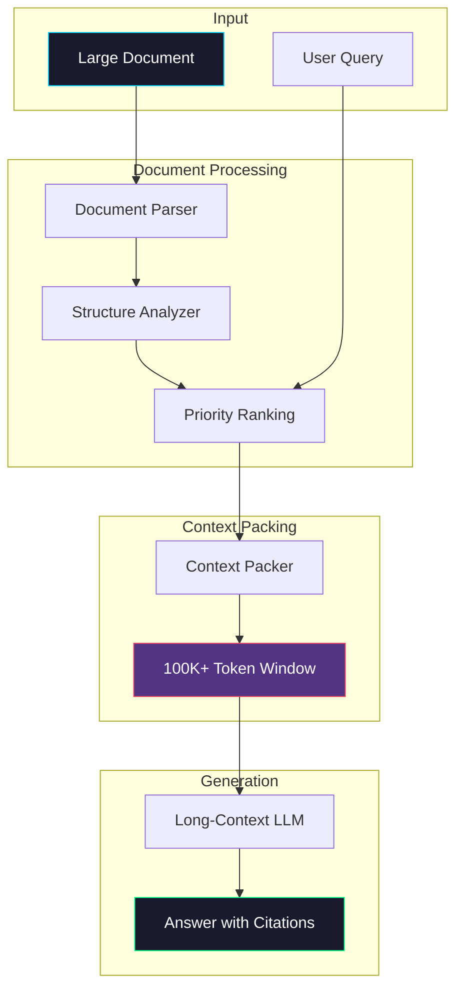

# Long-Context RAG

> **Leveraging 100K+ token context windows for full-document understanding**

## 📖 Overview

Long-Context RAG eliminates information loss from chunking by fitting entire documents into the context window of modern LLMs. This approach is ideal when full document context is critical for accurate answers.

### When to Use

✅ **Best for:**
- Legal document analysis
- Financial report deep-dives
- Code repository understanding
- Complex documents with cross-references
- When chunking causes context loss

❌ **Avoid for:**
- High query volume (cost)
- Real-time applications
- Documents larger than context window
- Simple factual queries

## 🏗️ Architecture



## 🔧 How It Works

### Step 1: Document Parsing
Parse the document while preserving structure:
- Headers and sections
- Tables and figures
- Cross-references
- Metadata

### Step 2: Priority Ranking
Rank sections by relevance to the query:
- Query-relevant sections first
- Structural elements (TOC, headers)
- Supporting context

### Step 3: Context Packing
Pack content into the context window:
- High-priority content first
- Respect token limits
- Maintain document coherence

### Step 4: Generation
Use a long-context LLM for answer generation with full document awareness.

## 💻 Quick Start

```python
from long_context import LongContextRAG

# Initialize
rag = LongContextRAG(
    llm_model="gpt-4-turbo",  # 128K context
    max_context_tokens=100000
)

# Query with full document
answer = rag.query(
    question="What are the key terms of the agreement?",
    document=contract_text
)
print(answer)
```

## 📊 Model Context Windows

| Model | Context Window | Cost/1M Input |
|-------|----------------|---------------|
| GPT-4 Turbo | 128K | $10.00 |
| Claude 3 Opus | 200K | $15.00 |
| Claude 3 Sonnet | 200K | $3.00 |
| Gemini 1.5 Pro | 1M | $7.00 |
| Llama 3 70B | 128K | Self-hosted |

## 💰 Cost Considerations

For a 100K token document:
- GPT-4 Turbo: ~$1.00 per query
- Claude 3 Sonnet: ~$0.30 per query
- Gemini 1.5 Pro: ~$0.70 per query

**Cost optimization strategies:**
1. Use smaller models for simple queries
2. Cache responses for repeated queries
3. Pre-filter documents when possible
4. Use summarization for overview queries

## ⚠️ Limitations

1. **Cost**: High per-query cost for long documents
2. **Latency**: 5-15s for very long contexts
3. **Lost in the Middle**: Some models struggle with middle content
4. **Token Counting**: Accurate estimation is challenging

## 🎯 Best Practices

1. **Use structured prompts**: Guide the model to relevant sections
2. **Request citations**: Ask for specific location references
3. **Chunk strategically**: Even with long context, organize logically
4. **Monitor usage**: Track tokens and costs carefully

## 📚 References

- [Lost in the Middle](https://arxiv.org/abs/2307.03172)
- [Extending Context Windows](https://arxiv.org/abs/2309.16039)
- [Long-Context Benchmark](https://arxiv.org/abs/2311.04939)

