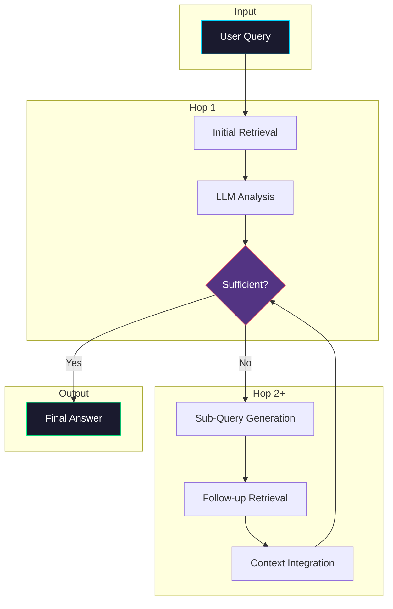

# Multi-Hop RAG

> **Iterative retrieval and reasoning across multiple documents for complex questions**

## 📖 Overview

Multi-Hop RAG addresses questions that cannot be answered from a single document or passage. It iteratively retrieves information, reasons over it, and generates follow-up queries until sufficient context is gathered.

### When to Use

✅ **Best for:**
- Questions requiring synthesis from multiple sources
- Complex analytical queries
- Research-style questions
- Questions with implicit dependencies

❌ **Avoid for:**
- Simple factual lookups
- Time-sensitive queries (high latency)
- Cost-sensitive applications

## 🏗️ Architecture



## 🔧 How It Works

### Step 1: Initial Retrieval
The system first retrieves documents relevant to the original query using standard vector search.

### Step 2: LLM Analysis
An LLM analyzes the retrieved context and determines:
- Can the question be fully answered?
- What additional information is needed?
- What follow-up questions should be asked?

### Step 3: Iterative Retrieval
If more information is needed, the system:
1. Generates targeted sub-queries
2. Retrieves additional relevant documents
3. Integrates new context with existing knowledge

### Step 4: Answer Synthesis
Once sufficient information is gathered, the LLM synthesizes a comprehensive answer with citations.

## 💻 Quick Start

```python
from multi_hop import MultiHopRAG

# Initialize
rag = MultiHopRAG(
    embedding_model="all-MiniLM-L6-v2",
    llm_model="gpt-4o",
    max_hops=3
)

# Index documents
rag.index_documents(documents)

# Query
answer = rag.query("What was the impact of Company X's acquisition on their Q4 revenue?")
print(answer)
```

## 📊 Performance

| Metric | Value |
|--------|-------|
| Avg. Hops | 2.3 |
| Latency (P50) | 2.1s |
| Latency (P99) | 4.5s |
| Faithfulness | 0.92 |
| Answer Relevancy | 0.89 |

## ⚠️ Limitations

1. **Latency**: Multiple LLM calls increase response time
2. **Cost**: Each hop involves embedding + LLM costs
3. **Error Propagation**: Early mistakes can compound
4. **Loop Risk**: May not converge on complex queries

## 🎯 Best Practices

1. **Set max_hops**: Prevent infinite loops
2. **Use confidence thresholds**: Stop when confident enough
3. **Cache embeddings**: Reuse across hops
4. **Monitor hop patterns**: Optimize based on real usage

## 📚 References

- [Multi-hop Question Answering](https://arxiv.org/abs/2103.12235)
- [Self-Ask: Measuring and Narrowing the Compositionality Gap](https://arxiv.org/abs/2210.03350)
- [IRCoT: Interleaving Retrieval with Chain-of-Thought](https://arxiv.org/abs/2212.10509)

