# Multimodal RAG

> **Retrieval and reasoning across text, images, audio, and other modalities**

## 📖 Overview

Multimodal RAG extends traditional text-based retrieval to handle multiple data types. It can process documents with embedded images, charts, tables, and even audio content.

### When to Use

✅ **Best for:**
- Documents with images/charts/diagrams
- Visual question answering
- Audio/video content search
- Mixed-media knowledge bases

❌ **Avoid for:**
- Text-only content
- Simple Q&A without visual context
- Cost-sensitive applications
- When latency < 2s is required

## 🏗️ Architecture

```mermaid
flowchart TB
    subgraph "Multimodal Input"
        T[📄 Text]
        I[🖼️ Images]
        A[🎵 Audio]
    end

    subgraph "Processing"
        TE[Text Encoder]
        VE[Vision Encoder]
        AE[Audio Transcriber]
    end

    subgraph "Unified Space"
        ALIGN[Alignment Layer]
        VS[(Vector Store)]
    end

    subgraph "Retrieval"
        Q[Query]
        RET[Cross-Modal Retrieval]
    end

    subgraph "Generation"
        MLLM[Multimodal LLM]
        ANS[Answer]
    end

    T --> TE
    I --> VE
    A --> AE
    TE --> ALIGN
    VE --> ALIGN
    AE --> ALIGN
    ALIGN --> VS
    Q --> RET
    VS --> RET
    RET --> MLLM
    MLLM --> ANS

    style VS fill:#533483,stroke:#e94560,color:#fff
    style MLLM fill:#e94560,stroke:#fff,color:#fff
    style ANS fill:#1a1a2e,stroke:#00ff88,color:#fff
```



## 🔧 How It Works

### Image Processing

1. **OCR Extraction**: Extract text from images using Tesseract
2. **Vision Encoding**: Generate image embeddings using CLIP
3. **Caption Generation**: Create textual descriptions using GPT-4V
4. **Object Detection**: Identify objects and their relationships

### Audio Processing

1. **Transcription**: Convert speech to text using Whisper
2. **Speaker Diarization**: Identify different speakers
3. **Timestamp Alignment**: Link text to audio timestamps
4. **Embedding**: Create searchable representations

### Cross-Modal Retrieval

Query can retrieve results across all modalities:
- Text query → Image results
- Image query → Related text
- "Find the chart showing Q4 revenue" → Image + context

## 💻 Quick Start

```python
from multimodal_rag import MultimodalRAG

# Initialize
rag = MultimodalRAG(
    vision_model="gpt-4o",
    embedding_model="clip-ViT-B-32",
    audio_model="whisper-base"
)

# Index multimodal content
rag.index_pdf_with_images("report.pdf")
rag.index_audio("meeting.mp3")

# Query across modalities
answer = rag.query(
    "What does the revenue chart in the Q4 report show?"
)
```

## 🖼️ Supported Vision Models

| Model | Provider | Capabilities |
|-------|----------|--------------|
| GPT-4o | OpenAI | Image understanding, OCR |
| Claude 3 | Anthropic | Image understanding |
| LLaVA 1.6 | Open Source | Image understanding |
| CLIP | OpenAI | Image-text similarity |

## 🎵 Supported Audio Models

| Model | Provider | Languages |
|-------|----------|-----------|
| Whisper Large | OpenAI | 99+ languages |
| Whisper API | OpenAI | 99+ languages |
| AssemblyAI | AssemblyAI | 100+ languages |

## 📊 Performance

| Task | Accuracy | Latency |
|------|----------|---------|
| Image + Text QA | 87% | 2.8s |
| Chart Understanding | 82% | 3.1s |
| Audio Transcription | 95% WER | 1.2s |
| Cross-Modal Retrieval | 79% | 1.5s |

## ⚠️ Limitations

1. **Cost**: Vision models are expensive
2. **Latency**: Processing images/audio adds overhead
3. **Quality**: OCR and transcription errors propagate
4. **Privacy**: May not be suitable for sensitive images
5. **Context**: Limited by vision model context windows

## 🎯 Best Practices

1. **Preprocess images**: Enhance quality for OCR
2. **Cache embeddings**: Expensive to regenerate
3. **Use descriptions**: Generate text descriptions for images
4. **Chunk audio**: Process in segments for long audio
5. **Validate OCR**: Human review for critical documents

## 📚 References

- [CLIP: Learning Transferable Visual Models](https://arxiv.org/abs/2103.00020)
- [LLaVA: Large Language and Vision Assistant](https://arxiv.org/abs/2304.08485)
- [Whisper: Robust Speech Recognition](https://arxiv.org/abs/2212.04356)

